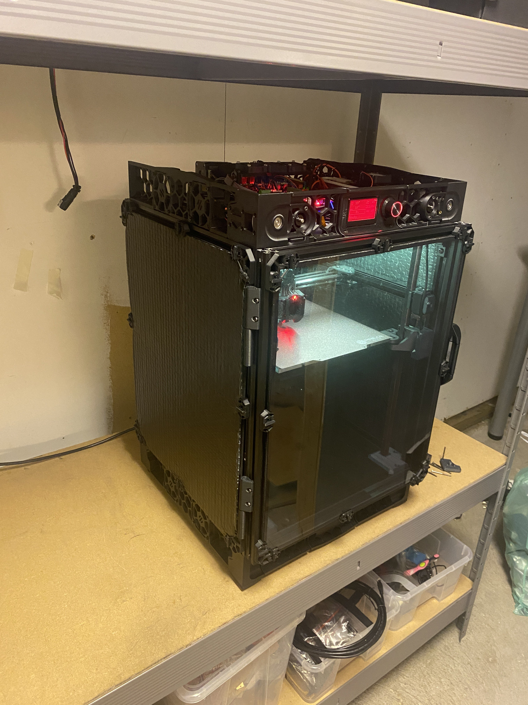

# Voron VT.1237

This repo contains data on VT.1237. 

## Config

Klipper configs for VT.1237 (Orion 250) printer running fluidd.

Macros and config files are separeted in folders.

## Main Components

### Electronics

- A/B Motors: Moons MS17HDBP4200
- Z Motors: E3D Super Whopper Motor
- MCU: Octopus Pro w/ TMC2209 & TMC5160
- PSU 24v: Mean Well RSP-200-24
- PSU 48v: Mean Well 48v psu
- PSU 5v: Mean Well RS-15-5
- Host: Raspberry Pi 4 Model B 8GB
- Display: Mini12864
- Camera: Logitech C920 HD Pro
- Relay: Shelly 1PM+

### CAN BUS toolhead
- Board: BTT EBB36
- Control board: BTT U2C
- CAN-cable: Custom 8-pin cable

### Toolhead
- Toolhead: Xol + G2SA
- Hotend: Phaetus Dragon HF
- Extruder: Galileo 2 StandAlone
- Probe: Beacon

### Enclosure
- General enclosure: Polycarbonate panels with foam
- Front door: [Extrusion door](https://github.com/tanaes/whopping_Voron_mods/blob/main/clickyclacky_door/)

### Mechanics & Frame
- Frame: LDO VT 250
- X linear rail: LDO
- Y linear rail: LDO
- Z linear rail: LDO
- Foamtape: [XFasten Black Foam Seal Tape](https://www.amazon.com/dp/B07QYGN3C1)

### Bed
- SSR: SSR 120/230 V/AC, 10 Ampere
- Heater pad: Keenovo silicone AC heater
- Buildplate: Universal, 250x250x8mm
- PEI: PrimaCreator Powder Coated PEI